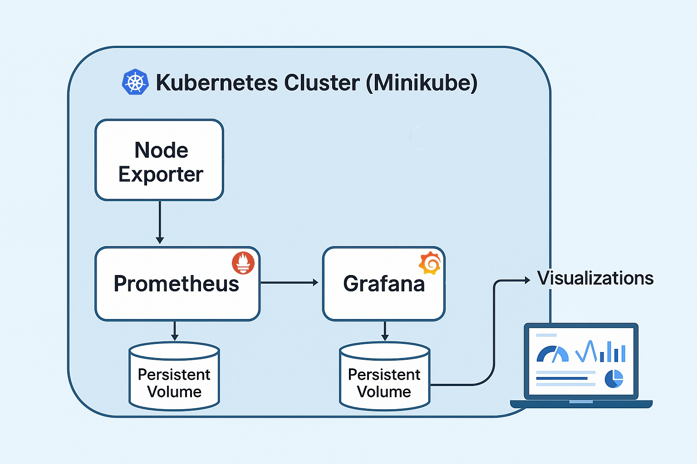
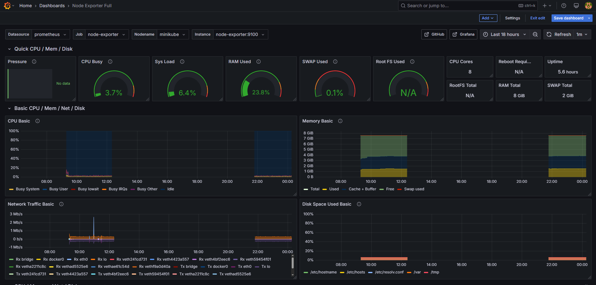

## English-version

[Haz click aquí para la versión en Español](#versión-en-español)

# Integration of Prometheus, Grafana and Node Exporter on Kubernetes

Welcome to my monitoring project using Prometheus, Grafana and Node Exporter! This setup allows you to effortlessly monitor the health and performance of your Kubernetes environments. Below, you'll find an overview of the project, how to deploy it and additional resources to get you started.

## Overview

This project simplifies the monitoring of Kubernetes using Prometheus for metrics collection, Grafana for visualization and Node Exporter for host-level metrics. Whether you're new to monitoring or looking to enhance your existing setup, these configurations and setup instructions will help you get up and running quickly.

> [!NOTE]
> This project was originally deployed on Kubernetes using Minikube. If you don't have Minikube installed, you can follow the installation instructions from the [Minikube documentation](https://minikube.sigs.k8s.io/docs/start/).

## Why this matters

Manually setting up monitoring in Kubernetes can be time-consuming and error-prone. This project automates the full stack deployment (Prometheus, Grafana, Node Exporter), reducing manual setup time by over 85%.  

It’s designed to serve as a monitoring foundation for development clusters or small production environments.

## Architecture Overview

The diagram below illustrates the full monitoring stack running inside a single Kubernetes cluster (Minikube). All components — Prometheus, Grafana, and Node Exporter — are deployed as containers in the same cluster.

- Prometheus scrapes metrics from Node Exporter and other targets.
- Grafana queries Prometheus to display dashboards.
- Persistent volumes ensure metrics and dashboards are retained after restarts.

This setup provides complete visibility over Minikube and demonstrates how to integrate core observability tools in Kubernetes.

## How to Use

### Getting Started

1. **Clone the Repository**:

         git clone https://github.com/LizzyMaken/prometheus-grafana-on-kubernetes.git
   
         cd prometheus-grafana-on-kubernetes

2. **Deploy Monitoring Stack**:

         bash scripts/deploy-monitoring-stack.sh

   This script handles the full deployment in logical order. It includes setting up PersistentVolumes, ConfigMaps,           Secrets, Deployments, and Services. Additionally, the script connects to the Minikube VM to create the                      `/data/prometheus` directory and sets the correct permissions to ensure Prometheus can write to its volume.
   
   It also deletes all existing resources defined in the YAML files to ensure a clean environment before redeployment. This prevents errors related to leftover configurations or persistent volumes that weren't properly released.
   
   Additionally, it explicitly forces the deletion of the Grafana pod using kubectl delete pod --force, since it may become stuck if it maintains active references to its persistent volume.

3. **Expose Services via LoadBalancer**:

         bash scripts/start-tunnel-and-show-urls.sh

   This script runs `minikube tunnel` in the background and displays the external IPs for Prometheus and Grafana. This       command is used to create a route to services deployed with the type LoadBalancer, allowing them to be accessed             externally. It exposes the external IP directly to programs running on the host operating system, enabling easier access    to those services.

   > Minikube doesn’t support external LoadBalancer IPs by default, but `minikube tunnel` simulates this behavior. It allows services of type LoadBalancer to be accessed externally, mimicking typical cloud environments.

### Accessing Prometheus and Grafana

- Use the printed URLs from the script output to access Grafana and Prometheus in your browser.
- Default URL will look like `http://<EXTERNAL_IP>:3000` and `http://<EXTERNAL_IP>:9090` (external IPs are also               accessible using the command `kubectl get svc grafana` after creating the tunnel).
- Login credentials for grafana are found in `grafana/grafana-secret.yaml`.

### Exploring Dashboards

- Grafana comes preconfigured with dashboards for system metrics.
- Customize and create new dashboards to monitor specific applications or environments.

#### 🧪 Example: Load a ready-made dashboard

1. Go to **Dashboard > + New > Import** in Grafana.
2. In a new browser tab, open [https://grafana.com/grafana/dashboards](https://grafana.com/grafana/dashboards).
3. Search for `Node Exporter Full` and click on the result.
4. Copy the dashboard ID (**1860**) and return to the Grafana import screen.
5. Paste `1860` into the **Grafana.com dashboard URL or ID** field and click **Load**.
6. In the **Select a Prometheus data source** dropdown, choose `Prometheus`, then click **Import**.

#### 📊 What you should see

The **Node Exporter Full** dashboard provides a detailed, real-time overview of node-level system metrics, such as:

- CPU usage breakdown
- Memory usage and swap
- Disk space per path
- Network traffic per interface
- System uptime and load

In the image below, there are two visible data groups. This happened because the computer running Minikube was turned off temporarily, causing a gap in data collection. Prometheus continues collecting once the node is reachable again.

### Undeploying the Stack

To clean up all the monitoring resources:

         bash scripts/undeploy-monitoring-stack.sh

> [!WARNING]
> In some situations, the grafana-data-claim can get stuck due to finalizers that prevent it from being fully deleted. To avoid this issue, the script forcefully deletes it using kubectl delete pvc --grace-period=0 --force, ensuring the process doesn't hang and can complete successfully.

## Additional Resources

Explore more about Prometheus, Grafana and monitoring practices:

- [Prometheus Documentation](https://prometheus.io/docs/)
- [Grafana Documentation](https://grafana.com/docs/)

## Contributing

I'm open to contributions! If you find any issues or have suggestions for improvements, feel free to open an issue or submit a pull request.

This project is licensed under the [MIT License](LICENSE).

Happy monitoring!

---

## Versión en Español

[Click here for English Version](#english-version)

# Integración de Prometheus, Grafana y Node Exporter en Kubernetes

¡Bienvenido a mi proyecto de monitorización utilizando Prometheus, Grafana y Node Exporter! Esta configuración te permitirá supervisar de manera eficiente la salud y el rendimiento de tus entornos en Kubernetes. A continuación, encontrarás una visión general del proyecto, cómo desplegarlo y recursos adicionales para comenzar.

## Descripción General

Este proyecto simplifica la monitorización de entornos en Kubernetes utilizando Prometheus para la recolección de métricas, Grafana para la visualización y Node Exporter para métricas a nivel de host. Ya sea que estés comenzando con la monitorización o busques mejorar tu configuración actual, estas instrucciones te ayudarán a empezar rápidamente.

> [!NOTE]
> Este proyecto fue originalmente desplegado en Kubernetes utilizando Minikube. Si no lo tienes instalado, puedes seguir las instrucciones de instalación en la [documentación de Minikube](https://minikube.sigs.k8s.io/docs/start/es/).

## Por qué es importante

Configurar manualmente un sistema de monitorización en Kubernetes puede ser lento y propenso a errores.  
Este proyecto automatiza el despliegue completo del stack (Prometheus, Grafana y Node Exporter), reduciendo el tiempo de configuración manual en más de un 85 %.

Está diseñado como base de monitorización para clústeres de desarrollo o entornos de producción pequeños.

## Descripción de la arquitectura

El siguiente diagrama muestra el stack de monitorización ejecutándose dentro de un único clúster de Kubernetes (Minikube). Todos los componentes —Prometheus, Grafana y Node Exporter— están desplegados como contenedores en el mismo clúster.

- Prometheus recolecta métricas de Node Exporter y otros targets.
- Grafana consulta Prometheus para mostrar dashboards.
- Los volúmenes persistentes garantizan que los datos se conserven tras reinicios.

Esta configuración ofrece visibilidad completa sobre Minikube y sirve como ejemplo claro de cómo integrar herramientas de observabilidad en Kubernetes.

## Uso

### Para empezar

1. **Clona el Repositorio**:

       git clone https://github.com/LizzyMaken/prometheus-grafana-on-kubernetes.git
       cd prometheus-grafana-on-kubernetes

2. **Despliega el stack de monitorización**:

       bash scripts/deploy-monitoring-stack.sh

   Este script automatiza todo el despliegue en orden lógico: volúmenes persistentes, ConfigMaps, Secrets, Deployments y Services. Además, se conecta automáticamente a la VM de Minikube para crear el directorio `/data/prometheus` y ajustar los permisos, garantizando que Prometheus pueda escribir en su volumen.
   
   También elimina todos los recursos existentes definidos en los archivos YAML para asegurar un entorno limpio antes del redepliegue. Esto evita errores relacionados con configuraciones anteriores o volúmenes persistentes no liberados correctamente.
    
   Además, fuerza explícitamente la eliminación del pod de Grafana con `kubectl delete pod --force`, ya que puede quedar bloqueado si mantiene referencias activas a su volumen persistente.

3. **Exponer servicios tipo LoadBalancer**:

       bash scripts/start-tunnel-and-show-urls.sh

   Este script ejecuta `minikube tunnel` en segundo plano y muestra las IPs externas de Prometheus y Grafana. Este comando se utiliza para crear una ruta hacia los servicios desplegados con el tipo LoadBalancer, lo que permite acceder a ellos externamente. Expone la IP externa directamente a los programas que se ejecutan en el sistema operativo host, facilitando el acceso a esos servicios.

   > Minikube no ofrece IPs externas de forma nativa, pero el comando `minikube tunnel` simula este comportamiento. Esto permite acceder externamente a servicios del tipo LoadBalancer, como ocurre habitualmente en entornos cloud.

### Accede a Prometheus y Grafana

- Utiliza las URLs impresas por el script para acceder a Prometheus y Grafana desde el navegador.
- Las URLs por defecto serán `http://<IP_EXTERNA>:3000` y `http://<IP_EXTERNA>:9090` (las IPs externas también son accesibles usando el comando `kubectl get svc grafana` después de crear el túnel).
- Las credenciales para Grafana están en `grafana/grafana-secret.yaml`.

### Explora los Paneles de Control

- Grafana viene preconfigurado con paneles de control para métricas del sistema.
- Personaliza y crea nuevos paneles para monitorear aplicaciones específicas o entornos.

#### 🧪 Ejemplo: Cargar un panel preexistente

1. Ve a **Dashboard > + New > Import** en Grafana.
2. Abre en otra pestaña del navegador la página [https://grafana.com/grafana/dashboards](https://grafana.com/grafana/dashboards).
3. Busca `Node Exporter Full` y haz clic en el resultado.
4. Copia el ID del panel (**1860**) y vuelve a la pantalla de importación en Grafana.
5. Pega `1860` en el campo **Grafana.com dashboard URL or ID** y haz clic en **Load**.
6. En el menú desplegable **Select a Prometheus data source**, selecciona `Prometheus` y luego haz clic en **Import**.

#### 📊 Qué deberías ver

El panel **Node Exporter Full** ofrece una visión completa de métricas en tiempo real a nivel de nodo, incluyendo:

- Uso de CPU desglosado
- Uso de memoria y swap
- Espacio en disco por ruta
- Tráfico de red por interfaz
- Tiempo de actividad y carga del sistema

En la imagen a continuación, se ven dos bloques de datos separados. Esto ocurre porque el ordenador que ejecutaba Minikube se apagó temporalmente, lo cual interrumpió la recogida de métricas. Prometheus reanuda la recopilación cuando el nodo vuelve a estar disponible.

### Eliminar el stack de monitorización

Para eliminar todos los recursos del entorno de monitorización:

         bash scripts/undeploy-monitoring-stack.sh

> [!WARNING]
> En algunas situaciones, el `grafana-data-claim` puede quedarse bloqueado debido a finalizers que impiden su eliminación completa. Para evitar este problema, el script fuerza su eliminación usando kubectl delete pvc --grace-period=0 --force, garantizando así que el proceso no se quede colgado y pueda continuar correctamente.

## Recursos Adicionales

Explora más sobre Prometheus, Grafana y prácticas de monitorización:

- [Documentación de Prometheus](https://prometheus.io/docs/)
- [Documentación de Grafana](https://grafana.com/docs/)

## Contribuciones

¡Estoy abierta a contribuciones! Si encuentras algún problema o tienes sugerencias para mejorar, no dudes en abrir un issue o enviar un pull request.

Este proyecto está licenciado bajo la [Licencia MIT](LICENSE).

¡Buena monitorización!
